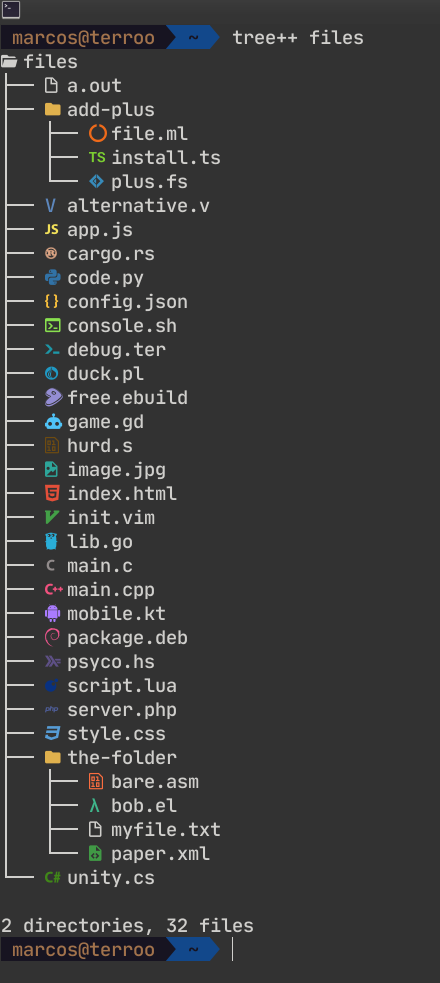

# `tree++`
The `tree` command with icons made with Modern C++

 

---

## Fonts
Install [Fonts Terminal Root](https://github.com/terroo/fonts)

---

## Quick install for Ubuntu
```bash
sudo wget -q4 \
  https://github.com/terroo/treepp/releases/download/v1.0.1/tree++ \
  -O /usr/local/bin/tree++ && \
  sudo chmod +x /usr/local/bin/tree++
```

Run:
```bash
tree++ --version # Or -v
```
> `tree++ v1.0.1`

---

## Build and install
```bash
git clone https://github.com/terroo/treepp
cmake -B build .
cmake --build build/
sudo cmake --install build/
```

---

## Using
> Examples
```bash
tree++ .
tree++ /path/to/dir
# or
tree++ /path/to/dir/
```
> The slash at the end does not depend on.

---

## Default `tree`
If you want it to be your default `tree` command, run:

```bash
sudo apt remove tree
sudo ln -s /usr/local/bin/tree++ /usr/local/bin/tree
```

---

## ToDo
- [ ] - Add colors! =)

---

## Debug
Want to debug before installing? Dependencies:

+ [Terlang](https://github.com/terroo/terlang)
+ [Clang++](https://clang.llvm.org/)
+ Optional: `sudo apt install libc++-dev libc++abi-dev`

Run:
```bash
ter debug.ter
./a.out
```

