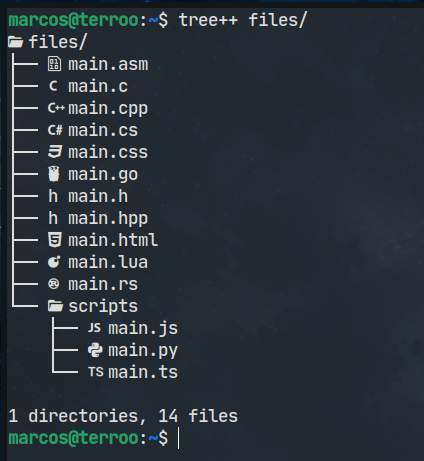

# `tree++`
The `tree` command with icons made with Modern C++

 

---

## Build ans install
```bash
git clone https://github.com/terroo/treepp
cmake -B build .
cmake --build build/
sudo cmake --install build/
```

---

## Using
> Examples
```bash
tree++ .
tree++ /path/to/dir
# or
tree++ /path/to/dir/
```
> The slash at the end does not depend on.

---

## Default `tree`
If you want it to be your default `tree` command, run:

```bash
sudo apt remove tree
sudo ln -s /usr/local/bin/tree++ /usr/local/bin/tree
```

---

## ToDo
- [ ] - Add colors! =)
- Fix sub directory icone :(
